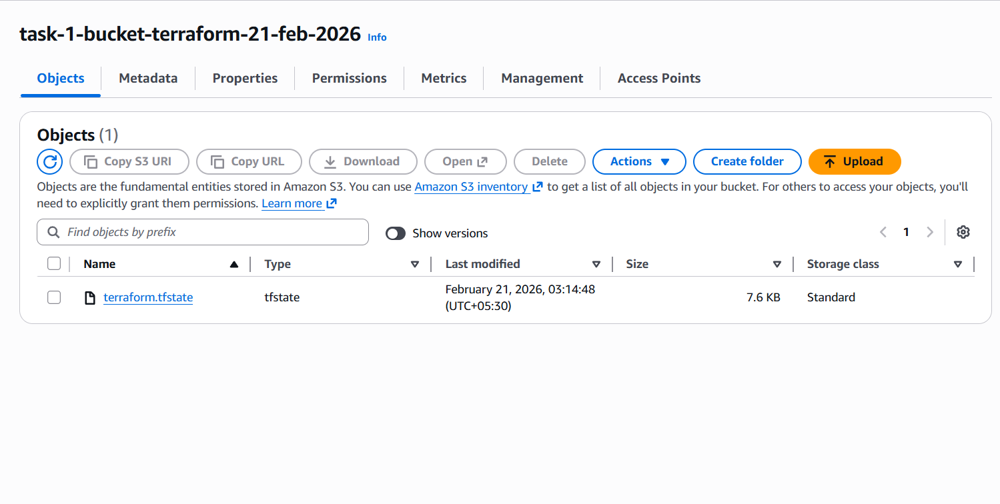
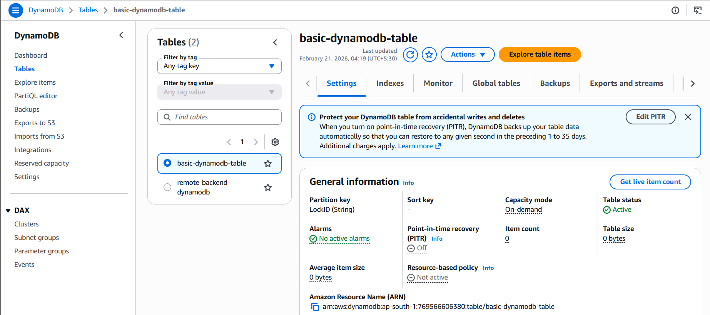

# Terraform Production-Ready Remote Backend Setup

## 📌 Objective

Configure a production-grade Terraform remote backend using:

- Amazon Web Services (AWS)
- Amazon S3 (Remote State Storage)
- Amazon DynamoDB (State Locking)

---

## 🏗 Architecture Overview

Terraform Remote Backend consists of:

- S3 Bucket → Stores terraform.tfstate
- DynamoDB Table → Provides state locking
- Versioning Enabled → Disaster recovery
- Server-Side Encryption Enabled → Security compliance

---

## ⚙️ Prerequisites

- AWS CLI configured
- Terraform installed
- IAM user/role with permissions:
  - S3 full access (for specific bucket)
  - DynamoDB full access (for specific table)

---
# 📸 Verification Screenshots

## 🗂 S3 Bucket (Remote State Storage)

Below screenshot confirms:

- S3 bucket created
- Versioning enabled
- Encryption enabled
- `terraform.tfstate` file present



---

## 🔐 DynamoDB Table (State Locking)

Below screenshot confirms:

- `terraform-state-locks` table exists
- Lock entry visible during `terraform apply`
- `LockID = terraform.tfstate`



---


---
# Step 1 — Create S3 Bucket for Remote State

## main.tf

```hcl
provider "aws" {
  region = "ap-south-1"
}

resource "aws_s3_bucket" "remote_state" {
  bucket = "kapil-prod-terraform-state-demo"

  tags = {
    Name        = "Terraform Remote Backend"
    Environment = "prod"
  }
}

resource "aws_s3_bucket_versioning" "versioning" {
  bucket = aws_s3_bucket.remote_state.id

  versioning_configuration {
    status = "Enabled"
  }
}

resource "aws_s3_bucket_server_side_encryption_configuration" "encryption" {
  bucket = aws_s3_bucket.remote_state.id

  rule {
    apply_server_side_encryption_by_default {
      sse_algorithm = "AES256"
    }
  }
}

resource "aws_s3_bucket_public_access_block" "block_public" {
  bucket = aws_s3_bucket.remote_state.id

  block_public_acls       = true
  block_public_policy     = true
  ignore_public_acls      = true
  restrict_public_buckets = true
}
```
---
# Step 2 — Create DynamoDB Table for State Locking

## 📌 Purpose

This configuration creates a DynamoDB table used by Terraform for **state locking** when working with a remote backend (such as S3).

State locking prevents multiple users or pipelines from modifying the Terraform state file at the same time, which helps avoid corruption and race conditions.

---

## 🏗 Terraform Resource

```hcl
resource "aws_dynamodb_table" "terraform_locks" {
  name         = "terraform-state-locks"
  billing_mode = "PAY_PER_REQUEST"
  hash_key     = "LockID"

  attribute {
    name = "LockID"
    type = "S"
  }

  tags = {
    Name        = "Terraform Lock Table"
    Environment = "prod"
  }
}
```

---


# Step 3 — Apply Infrastructure

Initialize and apply the Terraform configuration:

```bash
terraform init
terraform apply
```

## ✅ Expected Output After Apply

After successful execution:

- S3 bucket is created
- Versioning is enabled on the bucket
- Server-side encryption is enabled
- DynamoDB table for state locking is created

---

# Step 4 — Configure Remote Backend

Create a new file named:

```
backend.tf
```

Add the following configuration:

```hcl
terraform {
  backend "s3" {
    bucket         = "kapil-prod-terraform-state-demo"
    key            = "terraform.tfstate"
    region         = "ap-south-1"
    dynamodb_table = "terraform-state-locks"
    encrypt        = true
  }
}
```

## 🔎 Configuration Explanation

- **bucket** → S3 bucket storing Terraform state
- **key** → Path inside the bucket
- **region** → AWS region
- **dynamodb_table** → Enables state locking
- **encrypt** → Encrypts state file at rest

---

# Step 5 — Reinitialize Backend

Run:

```bash
terraform init
```

Terraform will:

- Detect backend configuration change
- Ask to migrate local state
- Migrate local state to S3
- Enable remote backend
- Configure DynamoDB state locking

Confirm by typing:

```
yes
```

---

# Step 6 — Verify No Local State Exists

After migration, verify that these files are NOT present locally:

```
terraform.tfstate
terraform.tfstate.backup
```
---

# Step 7 — Test State Locking

To verify that DynamoDB state locking is working correctly, simulate concurrent Terraform executions.

## 🖥 Open Terminal 1

Run:

```bash
terraform apply
```

Keep this process running.

---

## 🖥 Open Terminal 2

In a separate terminal window, run:

```bash
terraform apply
```

---

## ✅ Expected Result

You should see an error similar to:

```
Error acquiring the state lock
```

This confirms:

- Terraform successfully acquired a lock in Terminal 1
- Terminal 2 cannot modify the state file simultaneously
- DynamoDB state locking is functioning correctly

---

# Step 8 — Verify Lock in AWS Console

1. Open AWS Console  
2. Navigate to **DynamoDB**  
3. Open table: `terraform-state-locks`

During the `terraform apply` execution, you will see a record like:

```
LockID = terraform.tfstate
```

## 🔎 What This Means

- The `LockID` represents the Terraform state file path.
- The lock entry is automatically created when Terraform runs.
- The entry is removed once the operation completes successfully.

---

## 🎯 Conclusion

State locking is now fully verified:

- Concurrent executions are prevented
- Infrastructure state remains consistent
- Remote backend is production-ready

---
